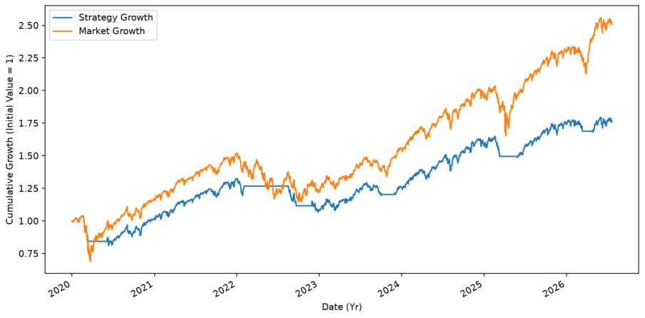
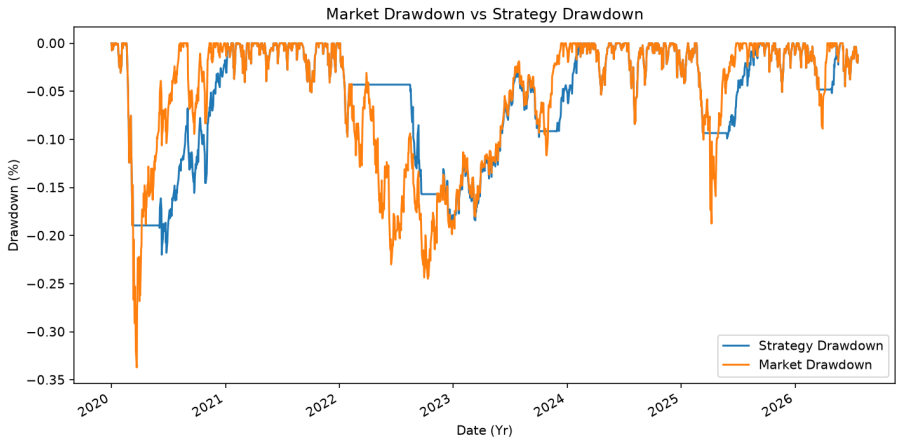
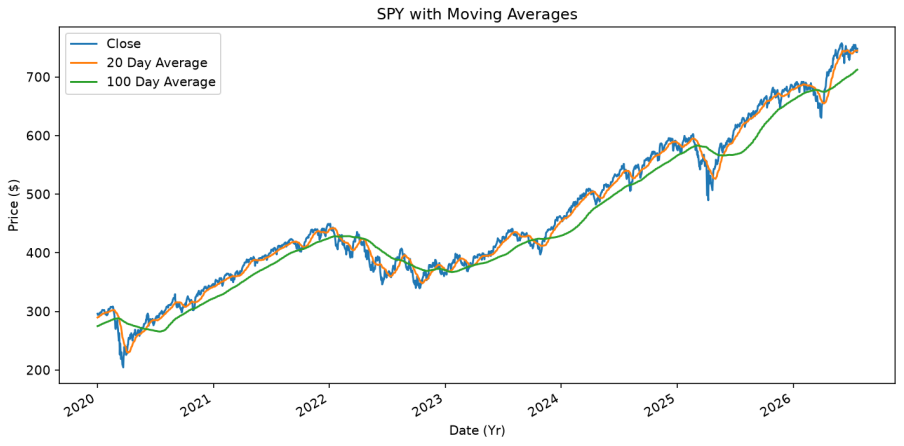

# spy-moving-average-backtest
A Python backtest of a 20/100-day moving-average crossover strategy on SPY, including transaction costs and benchmark performance analysis.

## OVERVIEW
I have built a backtester to see if I could in some way beat simply just buying holding an asset for years. The Ticker I used as my test subject 
is the SPY (a tracker of the S&P500), and to produce my signals I compared 20 and 100 day moving averages. The metrics I primarily compared were,
total return, Sharpe ratio, CAGR, volatility and drawdown. 

## STRATEGY
The strategy uses 20 day and 100 day simple-moving-averages. These periods represent roughly 1 month of trading time and 5 months of trading activity 
respectively. I selected these timeframes to balance noise reduction and responsiveness. Shorter time frames yielded noisier and variable moving
averages whereas longer time frames gave a moving average that was slower to respond to moves in the market. The values I have chosen are intended to 
give smooth and responsive moving averages that give valid results when used. however, these values are not assumed to be optimal. 

The strategy I have chosen is a long-only trend-following strategy. If the 20-day average moves above the 100-day average, a signal is produced and the 
backtester enters a long position. It then stays in the position until the 20-day moving average goes below the 100-day average in which case, it 
leaves the position and holds its cash until another signal. 

It is worth mentioning that if a signal is produced on day t, then the backtester will only enter the position on day t + 1. This is intentional
and avoids look-ahead bias. 

## DATA AND ASSUMPTIONS
### DATA
The dataset I decided to use was SPY, This is an ETF tracking the S&P 500 that was retrieved from yahoo finance using the yfinance python package.
I tested over a period of just over six years worth of daily trading data (beginning 2020-01-01 and ending 2026-07-21), specifically the closing price, 
making sure to adjust for dividends and stock splits (by setting auto_adjust = True). To guarantee clean data I created a function that sorts
entries into chronological order, removes duplicate values and removes missing entries. The benchmark for the backtester was a continuously invested buy-and-hold 
position in SPY. To generate the first part of the 100 day moving average I have added a warmup period at the beginning of the backtest to ensure the results are 
fair. 
### ASSUMPTIONS
The strategy is long-only and when invested the backtester allocates 100% of its cash into SPY. When the strategy is not invested, it holds 100% cash. The cash does 
not accrue interest and returns are always reinvested and compounded. A five-basis-point transaction cost is taken at every entry and exit. Slippage and bid-ask 
spreads are not modelled. Orders are assumed to be filled at the required price. A signal that  is generated on day t dictates exposure over the next close-to-close 
return interval. We are not using leverage for this strategy. When calculating  Sharpe ratios we assume a risk-free rate of zero and that there are 252 trading days 
in a year. Taxes are not considered and if the testing period ends with the strategy still being invested a transaction cost is not taken from the final result.

## METHODOLOGY
### PREPARATION
To begin with we have to have data to work with. Because the 100-day moving average needs a 'warm-up' period I downloaded seven months of extra data before the
start date of 2020-01-01. This is over 100 days and allows us to perform the warmup. As I've previously stated in the DATA section I cleaned the data by 
ordering it, removing duplicates and missing closing prices. Once the data was clean I used those extra seven months to start the moving averages and restricted 
the testing window such that it started on 2020-01-01 and ended on 2026-07-21. 
### POSITIONS AND RETURNS
To begin with I Calculated the daily percentage returns. The formula for which is: Daily return = (Current closing price / previous closing price) - 1. Next, using 
the aforementioned extra data, I calculated the 20 day and 100 day moving averages and plotted them. For the signal to work we need the crossover condition to be 
binary, A signal of 1 means we are invested (20 day SMA > 100 day SMA) and a signal of 0 means we are holding cash (100 day SMA > 20 day SMA). To avoid look-ahead 
bias, I shifted the signal forward by 1 day. This means the backtester can only make a trade with information it would realistically already have (not picking up the 
return on the day the signal was formed). The position determined by the previous day’s signal was applied to the next close-to-close return interval. At the end of 
this part of the code is the consideration for the transaction costs. As stated in ASSUMPTIONS I have chosen a fixed cost of 5 basis points. We apply this when 
calculating strategy returns: Strategy return = Position x Market return - 0.0005 X |Trade|. The Trade column is: Trade = Todays position - Previous day position. We 
must make trade an absolute value so that both entering and exiting the market yields a negative cost to the strategy return.
### CONSTRUCTING AND EVALUATING THE BACKTEST
The backtest begins the position value created in the warm-up stage (in our case 1). The strategy is created by compounding the daily returns when the backtester is 
invested (position value = 1). We calculate this as: New portfolio value = previous portfolio value x (1 + Daily return) A 5 basis point charge is taken if the 
backtester begins invested (if first tested position = 1). Then the strategy is plotted against the equity curve of the market which we use as our benchmark. Finally 
we select the final closing value as this is our final strategy value, this is done without forcing an exit. Using the values for strategy growth and market growth 
we can now calculate and compare performance statistics from the same fixed testing period.
### CONSISTENCY CHECK
Several consistency checks were used to validate the backtest. Positions were restricted to 0 or 1, both portfolios were evaluated over the same dates and the trade
counts were checked against the initial and final positions. The final output contained eight entries, seven exits, seven completed trades and one open trade.
this is consistent with the strategy beginning and ending invested.

## PERFORMANCE METRICS
- **Total return:** The percentage change in portfolio value over the testing period.
- **Compound annual growth rate (CAGR):** The constant annual growth that would produce the total growth after accounting for compounding.
- **Annualised volatility:** The annualised standard deviation of daily returns. It measures how widely the returns fluctuate and is used as a measure of risk.
- **Sharpe ratio:** The average excess return earned per unit of volatility. This backtest assumes the risk free rate of return is zero.
- **Maximum drawdown:** The largest peak-to-trough decline in cumulative portfolio value during the testing period.
- **Exposure:** The percentage of days the portfolio holds a position in the market.
- **Winning trade rate:** Percentage of completed trades that produced a positive net return after transaction cost.

## RESULTS
| Metric | Strategy | Buy and Hold |
|---|---:|---:|
| Total return | 77.27% | 152.69% |
| CAGR | 9.14% | 15.21% |
| Annualised volatility | 13.58% | 20.25% |
| Sharpe ratio | 0.71 | 0.80 |
| Maximum drawdown | -21.99% | -33.72% |
| Exposure | 77.99% | 100.00% |

### EQUITY CURVE

### DRAWDOWN

### MOVING-AVERAGE SIGNALS

 

